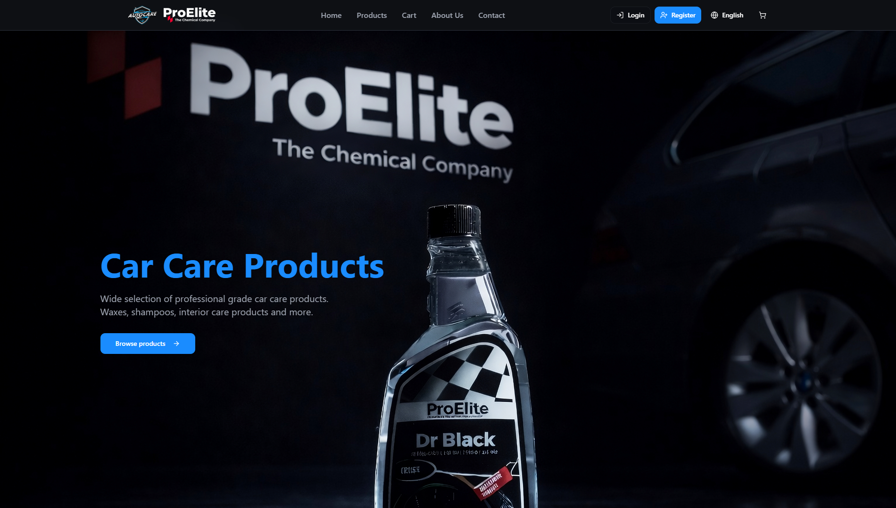
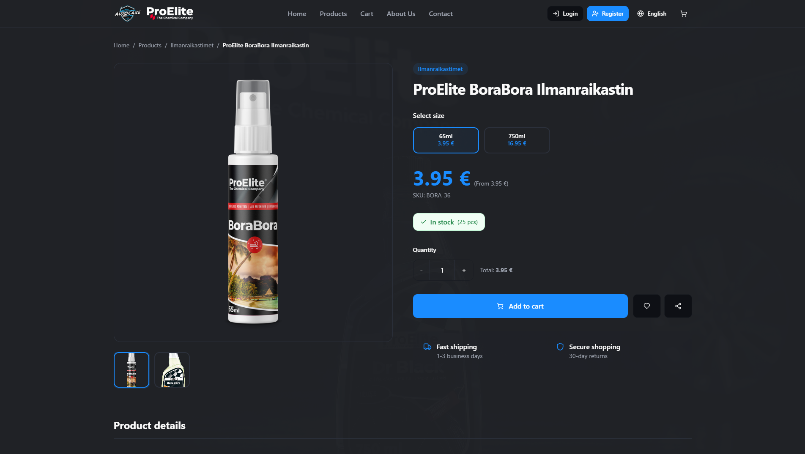
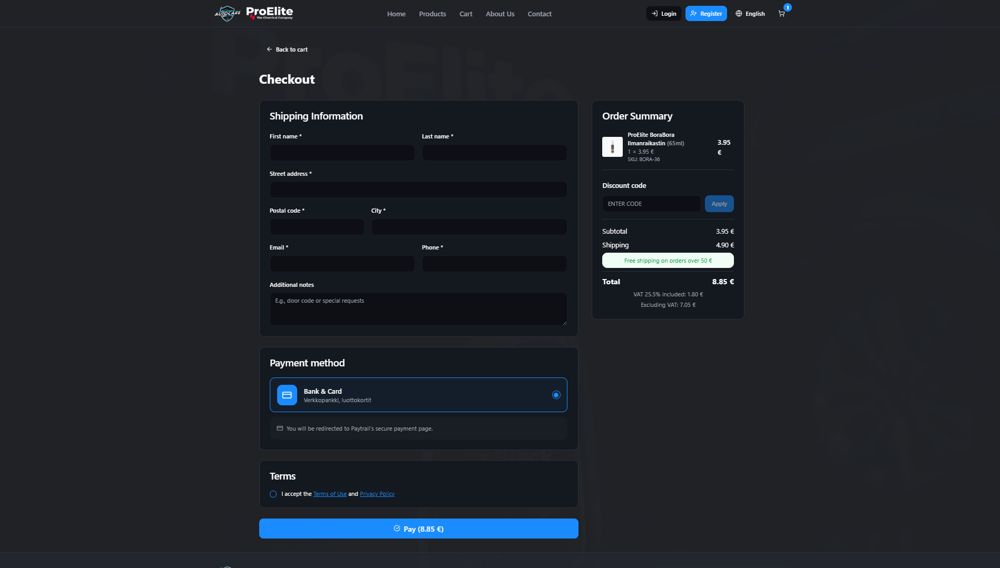

# Webshop

A fully functional e-commerce website for car care products.

## 🔗 Live Demo
https://www.autocarekauppa.fi

## 🛠️ Tech Stack
- React + TypeScript
- Firebase (Auth, Firestore, Cloud Functions)
- Paytrail payment gateway
- Tailwind CSS + shadcn/ui
- i18n (Finnish & English)

## ✨ Key Features
- Complete checkout with Paytrail
- User accounts with email verification
- Wishlist & order history
- Admin dashboard for product management
- Employee internal ordering system
- Newsletter subscription with unsubscribe
- reCAPTCHA security

## 📸 Screenshots

## 🎯 What I built
- Full frontend from scratch using React
- Firebase backend integration (Auth, Firestore)
- Payment integration with Paytrail API
- Complete order management system
- Multi-language support
